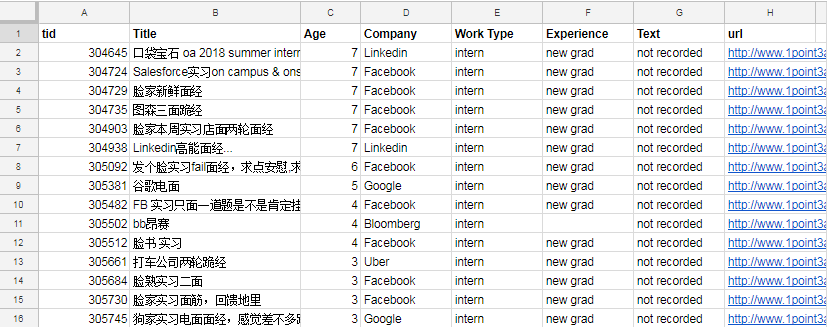
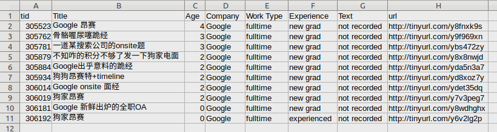

# Sprouts

从一亩三分地论坛获取新帖，将摘要存入Google Sheets或本地csv文件。

## Installation
``` shell
pip3 install -r requirements.txt
```

操作Google Sheets需开启Google Sheets API和下载client_secret.json，请参考[Turn on the Google Sheets API](https://developers.google.com/sheets/api/quickstart/python)获取。

## Usage

### Exampel 1
将论坛前5页，发帖时间在一周内的Intern面经存入指定的Google Sheets：
``` shell
python3 sprouts --page_number 5 --max_age 7 \
      --work_type intern \
      --gsheet_id [GOOGLE SHEETS ID]
```


### Example 2
将论坛前5页，发帖时间在一周内的Google全职面经存入Google.csv，帖子链接使用TinyURL短网址：

``` shell
python3 sprouts --page_number 5 --max_age 7 \
    --company Google --work_type fulltime  \
    --csv_file Google.csv \
    --use_shortened_url
```


关于其他参数：
```
python3 sprouts --help
```

## Other
用论坛前5页，发帖时间在一周内的面经生成的词云:  

